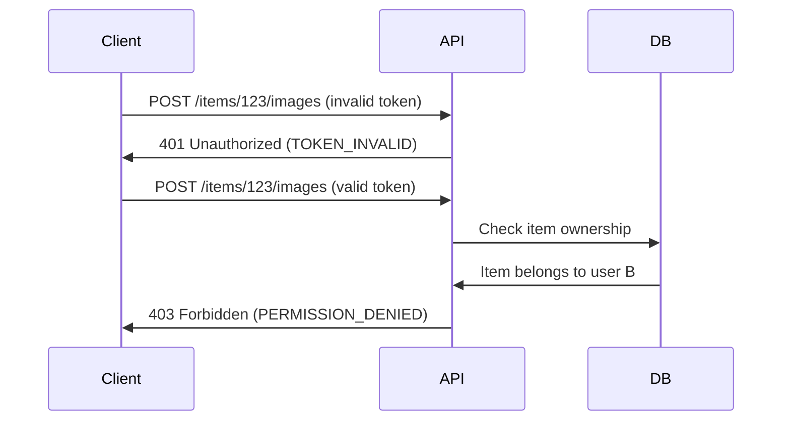

# 🛍️ StudentMarketPlace

**StudentMarketPlace** is a user-friendly web application that allows university students to **list**, **search**, and **purchase** second-hand items like electronics, books, clothing, and furniture.

---

## 📌 Features

- 📋 Post items for sale (title, description, price, category, condition)
- 🔍 Search and filter listings
- 🧾 View item details
- 🔐 JWT-based authentication for sellers and buyers
- 🎨 Clean and responsive UI

---

## 📚 Tech Stack

- **Backend**: Python, Flask, SQLAlchemy, Marshmallow, JWT
- **Database**: PostgreSQL / SQLite
- **Frontend**: HTML, CSS, JavaScript
- **API**: RESTful API design

---

## 🧠 System Call Graph

This diagram gives a quick overview of how different parts of the system interact:


---

## 🧠 Sequence diagram
The shows image upload API error handling (invalid token, permission denied)




## 🚀 Getting Started

1. **Clone the repo**  
   ```bash
   git clone https://github.com/Flow-Pie/StudentMarketPlace.git
   cd StudentMarketPlace
